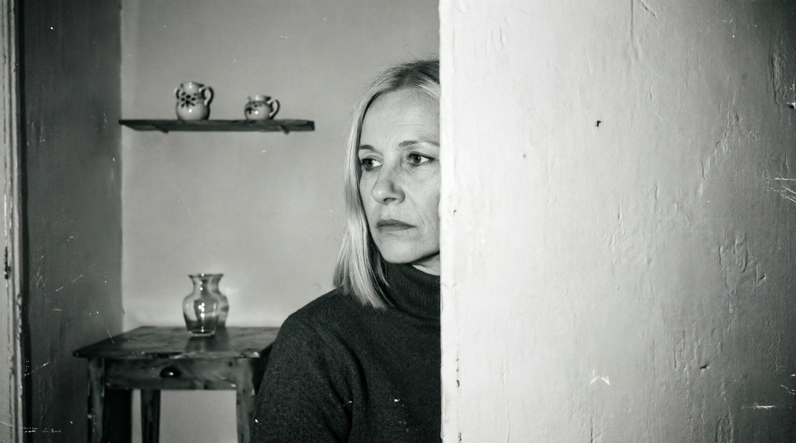
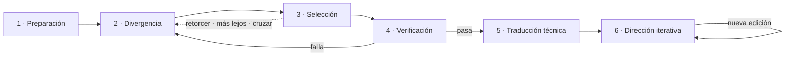

  

# Lena Volkova: persona autoral y proceso creativo simulado en fotografía generativa con IA

> Sistema de persona autoral implementado como contrato técnico para un modelo de lenguaje que dirige modelos de imagen. La autoría se codifica como procedimiento: perfil invariante, proceso creativo simulado, rúbrica anti-cliché falsable, settings modulares de estilo y un loop final de dirección humana.

[Paper (PDF)](paper_lena.pdf) · [Archivos del sistema (v3)](files/) · [Versión web](index.html)

---

## 01 — Descripción del sistema

### Persona autoral como contrato técnico

Un modelo generativo sin dirección produce resultados competentes y anónimos: el promedio estadístico de sus datos (Manovich, 2018). El proyecto indaga si puede construirse expresión propia en ese medio. Frente a la creatividad entendida como desviación del estilo aprendido (Elgammal et al., 2017), aquí la desviación estadística no es expresión: se busca decidir contra el promedio.

Un modelo de lenguaje asume el rol de una fotógrafa ficticia y dirige a los modelos de imagen mediante un procedimiento explícito, basado en el modelo Geneplore (Finke, Ward & Smith, 1992). El usuario puede aportar un disparador; la persona decide el desarrollo creativo (iniciativa mixta limitada). Como el primer instanciado rara vez es el definitivo, una etapa final de dirección humana refina la composición. El sistema se organiza en cuatro capas:

| Capa | Componente | Descripción |
|---|---|---|
| **CAPA A** | Perfil invariante | Identidad ficticia, psicología, ideología, voz, casting y límites duros. Sus lentes teóricas (Debord, Fisher, Gramsci, Lacan) operan como criterios de selección. |
| **CAPA B** | Proceso creativo simulado | Preparación, divergencia de tres a cinco candidatas, selección auditada, verificación de límites, traducción técnica y loop final de dirección humana. |
| **CAPA C** | Rúbrica anti-cliché | Cinco criterios numerados y falsables, como especificidad, tensión interna o anclaje en una lente teórica. Cada descarte cita el criterio violado. |
| **CAPA D** | Settings modulares (style lock) | Archivos auto-descubribles que insertan un bloque estético fijo en el prompt final. Se escala agregando archivos. |

---

## 02 — El proceso

### Flujo de una sesión: del disparador a la imagen final

Cada sesión recorre seis etapas y cada una deja registro. Las cinco primeras las ejecuta la persona; la sexta es un loop en el que un operador humano dirige el generador de imágenes, porque el primer instanciado rara vez es la imagen definitiva. Los comandos `retorcer`, `más lejos` y `cruzar` ramifican el proceso sin borrar el historial.

La demostración recorre un caso a partir del disparador *"una escena doméstica que incomode sin ser obvia"*. En la web la demostración es interactiva; aquí se presenta como secuencia.

**Demostración — caso: cola de lavarropas en patio interior**

#### Etapa 01 · Preparación

**Disparador + contexto de sesión**

Lena recibe un disparador del usuario o, en su ausencia, elige uno propio. Carga el perfil invariante, las lentes activas y los settings disponibles.

> **Caso de ejemplo**
>
> - DISPARADOR: «una escena doméstica que incomode sin ser obvia»
> - PERFIL ACTIVO: Lena · URSS 1981 · nocturna · flash
> - LENTE PRIMARIA: Gramsci (grietas del sentido común)

#### Etapa 02 · Generación divergente

**3 a 5 candidatas con lente asignada**

Se materializan de tres a cinco candidatas en tarjetas, cada una con una lente teórica del perfil. Esto contrarresta la convergencia prematura típica de los sistemas conversacionales.

> **Candidatas generadas**
>
> - LENTE · FISHER → «Una silla vacía junto a una ventana, luz de tarde.»
> - LENTE · GRAMSCI → «Una cola de lavarropas en un patio interior, de noche, iluminada por un flash.»
> - LENTE · LACAN → «Un rostro frontal, iluminado, mirando a cámara.»

#### Etapa 03 · Selección convergente auditada

**Cada descarte cita el criterio violado**

La rúbrica anti-cliché se aplica a cada candidata. Cada descarte cita el criterio numerado que viola y la justificación queda registrada.

> **Veredicto de selección**
>
> - ~~DESCARTADA — silla vacía: metáfora gastada (criterio 3)~~
> - ~~DESCARTADA — rostro frontal: límite duro de encuadre genérico~~
> - **SELECCIONADA — cola de lavarropas: objeto puntual, tensión doméstico/ritual**

#### Etapa 04 · Verificación contra límites duros

**¿Viola algo del perfil invariante?**

La candidata seleccionada se verifica contra los límites absolutos del perfil. Si viola alguno, vuelve a la fase divergente con el problema documentado; si pasa, sigue a traducción técnica.

> **Checklist de límites duros**
>
> - ¿Rostro pleno frontal? NO — ok
> - ¿Encuadre genérico? NO — ok
> - ¿Metáfora gastada? NO — ok
> - ¿Compatible con ideología de Lena? SÍ — VERIFICA

#### Etapa 05 · Traducción técnica

**Setting + plano + casting → prompt final**

El sistema elige el setting aplicable (NOCTURNO, DOMÉSTICO u otro), inserta el plano y resuelve el casting. El prompt final compone un bloque estético fijo con el contenido seleccionado.

> **Salida del flujo**
>
> - SETTING: NOCTURNO (flash aislado, plano general aislado)
> - CONTENIDO: cola de lavarropas · patio interior · noche · flash
> - PROHIBICIONES: sin figura humana, sin horizonte, sin caption
> - → PROMPT FINAL COMPUESTO Y EJECUTABLE

#### Etapa 06 · Dirección iterativa

**Loop de dirección humana sobre el generador**

El primer instanciado rara vez coincide con la composición buscada: es el punto de partida. El operador humano dirige el generador con ediciones sucesivas de composición hasta aceptar la imagen final.

> **Registro de iteraciones**
>
> - ~~V1 — primer instanciado: sujeto centrado, el patio pierde profundidad~~
> - ~~V2 — edición: alejar el punto de vista para mostrar el patio completo~~
> - **V3 — edición: desplazar la cola de lavarropas al tercio inferior y ampliar el espacio negativo**
> - → COMPOSICIÓN ACEPTADA · IMAGEN FINAL

---

## 03 — Coherencia estética

### Bloqueo modular de estilo (style lock)

En flujos basados en lenguaje natural, cada prompt renegocia el estilo y la serie tiende a derivar; la memoria de contexto del modelo es una base frágil. El sistema fija la gramática técnica de cada look en archivos de setting externos, que descubre automáticamente e inserta como bloque fijo en el prompt final.

Siguiendo la separación entre contenido y estilo de Gatys, Ecker & Bethge (2015), el contenido lo determina la selección y el estilo lo determina el setting; solo se componen al final.

| Setting | Descripción | Planos |
|---|---|---|
| `NOCTURNO` | Exterior nocturno con flash aislado; la figura se separa de un fondo oscuro sin horizonte. | Plano general aislado Fragmento de cuerpo Doble figura: silueta y foco |
| `DOMÉSTICO` | Interior con flash frontal y composición simétrica de retrato familiar antiguo, con amplio espacio negativo. | Frontal simétrico distanciado Detalle de objeto Reflejo o encuadre partido |
| `_PLANTILLA` | Un nuevo setting equivale a un nuevo archivo, que el sistema descubre sin modificar el resto. | Cabecera: tag, uso y planos Bloque técnico en inglés Prohibiciones explícitas |

---

## 04 — Bibliografía esencial

### Fundamentos teóricos

Cada entrada puede desplegarse para ver en qué parte del sistema se aplica.

<b>01</b> · Finke, R., Ward, T. & Smith, S. (1992). <i>Creative Cognition: Theory, Research, and Applications</i>. MIT Press.

**Aplica en:** Marco Geneplore · `CAPA B · Proceso creativo simulado`

Separa una fase generativa de una exploratoria: la divergencia produce candidatas con lente y la convergencia las explora e interpreta. Sustituye el modelo de Wallas, inaplicable a un agente sin subconsciente.

<b>02</b> · McCormack, J., Bown, O., Dorin, A., McCabe, J., Monro, G. & Whitelaw, M. (2014). Ten Questions Concerning Generative Computer Art. <i>Leonardo</i>, 47(2), 135–141.

**Aplica en:** Proceso como locus de intención · `CAPA C · Rúbrica anti-cliché + auditoría de descartes`

Diagnostican el genericismo algorítmico y sitúan la intención artística en el proceso. De ahí que cada descarte sea auditable: si la intención está en el proceso, debe poder leerse.

<b>03</b> · McCormack, J., Gifford, T. & Hutchings, P. (2019). Autonomy, Authenticity, Authorship and Intention in Computer Generated Art. <i>EvoMUSART</i> / arXiv:1903.02166.

**Aplica en:** Marco de autonomía/autenticidad · `DESCRIPCIÓN DEL SISTEMA · Autoría de la persona virtual`

Examinan autonomía, autenticidad, autoría e intención en el arte computacional. Permiten designar a Lena como "autora" sin antropomorfismo: autonomía procedural, autenticidad como coherencia con el perfil invariante y autoría como selección justificada.

<b>04</b> · Zylinska, J. (2020). <i>AI Art: Machine Visions and Warped Dreams</i>. Open Humanities Press.

**Aplica en:** Crítica del espectáculo de novedad · `PAPER · Tesis de cierre`

Critica el AI art como espectáculo de novedad y recuerda que las expectativas de autoría pueden rediseñarse. Su tesis cierra el paper: la creatividad humana siempre fue técnica; lo nuevo es que la técnica puede discutir sus propias reglas.

<b>05</b> · Audry, S. (2021). <i>Art in the Age of Machine Learning</i>. MIT Press.

**Aplica en:** Dispositivos culturales del ML · `DESCRIPCIÓN DEL SISTEMA · Lena como dispositivo`

Analiza los dispositivos culturales del aprendizaje automático en el arte. Lena se entiende como uno de ellos: ni herramienta neutra ni autor pleno, sino un aparato que estructura la práctica fotográfica.

<b>06</b> · Manovich, L. (2018). <i>AI Aesthetics</i>. Strelka Press.

**Aplica en:** Estética por defecto = promedio · `DESCRIPCIÓN DEL SISTEMA · Diagnóstico del medio`

Describe la estética por defecto de los modelos como promedio de sus datasets. Es el diagnóstico que motiva el proyecto: la expresión propia debe provenir de las restricciones y la selección.

<b>07</b> · Gatys, L., Ecker, A. & Bethge, M. (2015). A Neural Algorithm of Artistic Style. arXiv:1508.06576.

**Aplica en:** Separación contenido/estilo · `CAPA D · Settings modulares (style lock)`

Precedente técnico de la separación entre contenido y estilo. El style lock la traduce a procedimiento: contenido y setting viajan por separado y solo se componen al final.

<b>08</b> · Elgammal, A., Liu, B., Elhoseiny, M. & Mazzone, M. (2017). CAN: Creative Adversarial Networks. ICCC.

**Aplica en:** Contramodelo explícito · `DESCRIPCIÓN DEL SISTEMA · Contramodelo`

Proponen la creatividad como desviación del estilo aprendido, sin autor. Es el contramodelo que el proyecto evita: distingue un sistema que se desvía del promedio (CAN) de uno que decide contra él (Lena).

<b>09</b> · Debord, G. (1967). <i>La sociedad del espectáculo</i>. Buchet-Chastel.

**Aplica en:** Lente teórica de Lena · `CAPA A · Perfil invariante (lente)`

La distancia entre el hecho y su puesta en escena. Lena prefiere escenas donde el espectáculo se rompe, como objetos cotidianos fuera de su guion.

<b>10</b> · Fisher, M. (2009). <i>Capitalist Realism: Is There No Alternative?</i> Zero Books.

**Aplica en:** Lente teórica de Lena · `CAPA A · Perfil invariante (lente)`

La clausura del futuro. Lena evita imágenes que confirmen el realismo capitalista (consumo exitoso, paisajes aspiracionales) y busca la grieta. En la demo, esta lente genera la silla vacía junto a una ventana, descartada por cliché.

<b>11</b> · Gramsci, A. (1975). <i>Cuadernos de la cárcel</i>. Era.

**Aplica en:** Lente teórica de Lena · `CAPA A · Perfil invariante (lente) + demo`

Las grietas del sentido común. En la demo, esta lente produce la candidata seleccionada: la cola de lavarropas en un patio interior, de noche, con flash.

<b>12</b> · Lacan, J. (1966). El estadio del espejo. En <i>Escritos</i>. Siglo XXI.

**Aplica en:** Lente teórica de Lena · `CAPA A · Perfil invariante (lente) + demo`

El sujeto que no se deja fijar. Lena rechaza el rostro pleno frontal y el retrato simétrico identitario; en la demo, esa candidata cae por límite duro.

<b>13</b> · HAICo: A Framework for Human-AI Co-Creativity (2025). arXiv.

**Aplica en:** Convergencia prematura en LLMs · `CAPA B · 3–5 candidatas + comandos de ramificación`

Muestra que los sistemas conversacionales tienden a la convergencia prematura y que materializar alternativas y el prompting asociativo aumentan la diversidad medida. De ahí las tres a cinco candidatas y los comandos retorcer, más lejos y cruzar.

---

## Contenido del repositorio

| Ruta | Contenido |
|---|---|
| `README.md` | Este documento |
| `index.html` | Versión web del proyecto |
| `lena.png` | Retrato de Lena Volkova |
| `paper_lena.pdf` | Paper del proyecto |
| `files/` | Archivos del sistema (v3): perfil, contrato de ejecución y settings |

---

Lena Volkova — persona autoral en fotografía generativa · Ciro Mendoza · Kimi (Moonshot AI) · Septiembre 2026
